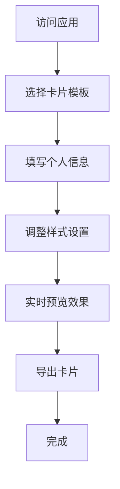

## 1. Product Overview
个人信息卡片生成器是一个交互式网页应用，允许用户创建、自定义和导出个性化信息卡片。
- 解决用户快速创建专业信息卡片的需求，适用于个人品牌推广、网络社交和职场交流。
- 目标用户为需要展示个人信息的专业人士、自由职业者和学生。

## 2. Core Features

### 2.1 User Roles
| Role | Registration Method | Core Permissions |
|------|---------------------|------------------|
| Normal User | 无需注册 | 创建、编辑、预览和导出信息卡片 |

### 2.2 Feature Module
1. **主页面**: 卡片预览区、表单输入区、模板选择区、样式设置区、导出功能

### 2.3 Page Details
| Page Name | Module Name | Feature description |
|-----------|-------------|---------------------|
| 主页面 | 卡片预览区 | 实时显示用户编辑的信息卡片效果，支持不同模板的预览 |
| 主页面 | 表单输入区 | 提供姓名、职位、公司、联系方式等个人信息输入字段 |
| 主页面 | 模板选择区 | 提供多种预设卡片模板供用户选择 |
| 主页面 | 样式设置区 | 允许用户自定义卡片颜色、字体、布局等样式 |
| 主页面 | 导出功能 | 支持将卡片导出为图片或PDF格式 |

## 3. Core Process
用户访问应用 → 选择卡片模板 → 填写个人信息 → 调整样式设置 → 实时预览效果 → 导出卡片

## 4. User Interface Design
### 4.1 Design Style
- 主色调: #3b82f6 (蓝色)、#6366f1 (紫色)
- 辅助色: #10b981 (绿色)、#f59e0b (橙色)
- 按钮样式: 圆角按钮，有轻微的阴影效果
- 字体: Inter (无衬线字体)，标题使用较大字号
- 布局风格: 左侧为编辑区，右侧为实时预览区，响应式设计
- 图标风格: 使用简约的线性图标

### 4.2 Page Design Overview
| Page Name | Module Name | UI Elements |
|-----------|-------------|-------------|
| 主页面 | 卡片预览区 | 居中显示卡片，有轻微的阴影和3D效果，支持卡片翻转查看背面 |
| 主页面 | 表单输入区 | 分组的表单字段，带有标签和占位符，实时验证输入内容 |
| 主页面 | 模板选择区 | 水平滚动的模板预览，点击切换模板 |
| 主页面 | 样式设置区 | 颜色选择器、字体选择器、滑块控件等，支持实时预览样式变化 |
| 主页面 | 导出功能 | 明显的导出按钮，下拉菜单选择导出格式 |

### 4.3 Responsiveness
- 桌面优先设计，在小屏幕设备上自动调整为垂直布局
- 支持触摸操作，适配移动设备
- 卡片预览区在小屏幕上占满宽度，编辑区可折叠

### 4.4 3D Scene Guidance
- 卡片预览区使用轻微的3D效果，模拟真实卡片的立体感
- 支持卡片的轻微旋转和阴影效果，增强视觉体验