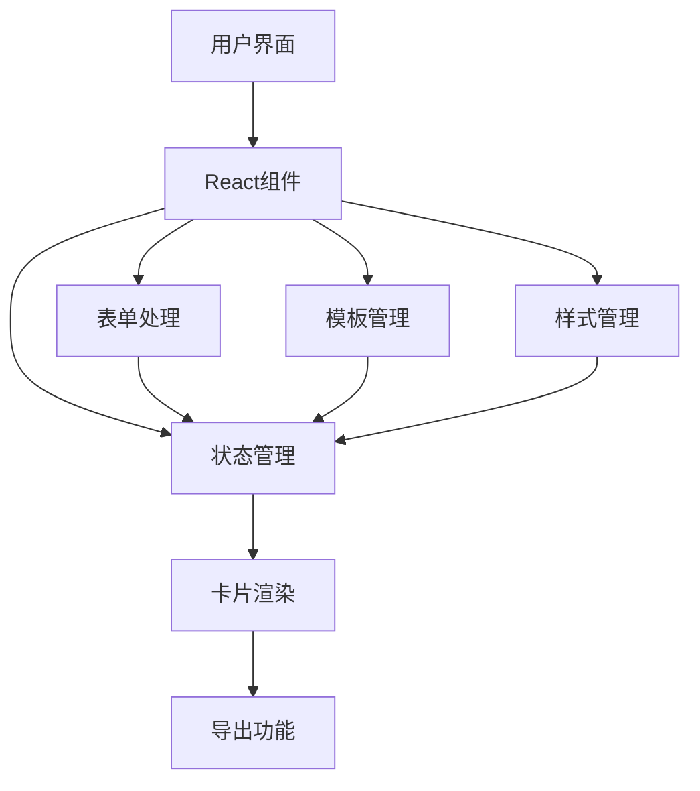
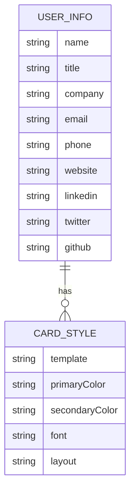

## 1. Architecture Design

## 2. Technology Description
- Frontend: React@18 + tailwindcss@3 + vite
- Initialization Tool: vite-init
- Backend: None (纯前端应用)
- 状态管理: Zustand
- 导出功能: html2canvas + jsPDF
- 图标库: Lucide React

## 3. Route Definitions
| Route | Purpose |
|-------|---------|
| / | 主页面，包含所有功能 |

## 4. API Definitions
无后端API，所有数据处理在前端完成。

## 5. Server Architecture Diagram
无后端服务器架构。

## 6. Data Model
### 6.1 Data Model Definition

### 6.2 Data Definition Language
无数据库，数据存储在前端状态中。

## 7. Component Structure
- App: 主应用组件
- CardPreview: 卡片预览组件
- FormInput: 个人信息输入表单
- TemplateSelector: 模板选择组件
- StyleSettings: 样式设置组件
- ExportOptions: 导出选项组件

## 8. State Management
使用Zustand管理应用状态，包括：
- 个人信息数据
- 卡片样式设置
- 选中的模板
- 导出格式

## 9. Export Functionality
- 使用html2canvas将卡片渲染为图片
- 使用jsPDF将卡片导出为PDF
- 支持PNG、JPG和PDF格式导出

## 10. Responsive Design
- 使用Tailwind CSS的响应式类
- 桌面端: 左右布局
- 移动端: 上下布局
- 适配不同屏幕尺寸